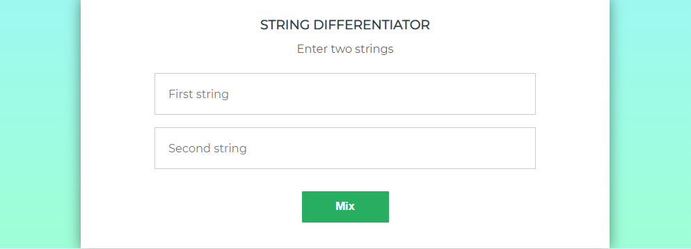
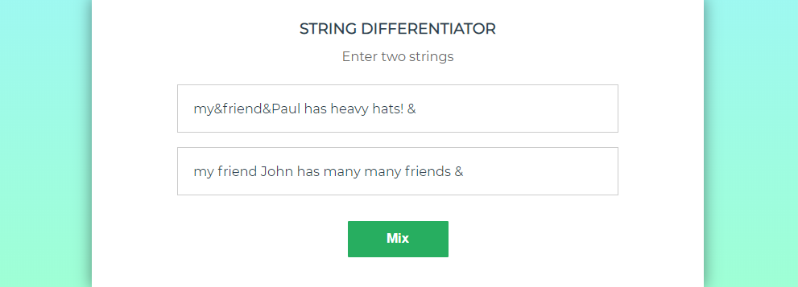
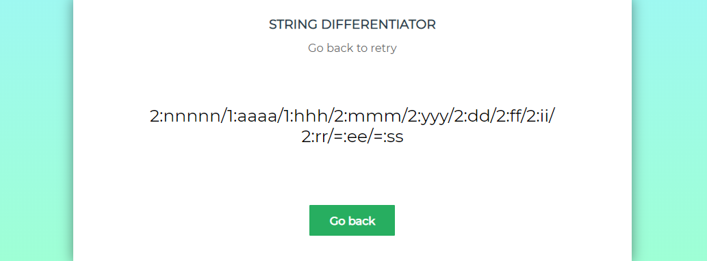

# String differentiator


## Introduction
### What?  
String differentiator is a project that provides differentiating strings as below:  

Given two strings s1 and s2, we want to visualise how different the two strings are.  
We will only take into account the lowercase letters (a to z). First let us count the frequency of each lowercase
letter in s1 and s2:  

- s1 = "A aaaa bb c"  
- s2 = "& aaa bbb c d"  
- s1 has 4 'a', 2 'b', 1 'c'  
- s2 has 3 'a', 3 'b', 1 'c', 1 'd'  

So the maximum for 'a' in s1 and s2 is 4 from s1; the maximum for 'b' is 3 from s2.  
In the following we will not consider letters when the maximum of their occurrences is less than or equal to 1.  

We can resume the differences between s1 and s2 in the following string: **"1:aaaa/2:bbb"** where **1**
in **1:aaaa** stands for string **s1** and **aaaa** because the maximum for a is **4**. In the same manner
**"2:bbb"** stands for string **s2** and **bbb** because the maximum for b is **3**.  

The objectif is to produce a string in which each lowercase letter of s1 or s2 appears as many times as
its maximum if this maximum is strictly greater than 1; these letters will be prefixed by the number
of the string where they appear with their maximum value and **:**. If the maximum is in s1 as well as
in s2 the prefix is **=:**.  

In the result, substrings will be in decreasing order of their length and when they have the same
length sorted alphabetically; the different groups will be separated by **'/'**.  

These examples can make this clearer:  

- s1 = "my&friend&Paul has heavy hats! &"
- s2 = "my friend John has many many friends &"
  - **mix(s1, s2) --> "2:nnnnn/1:aaaa/1:hhh/2:mmm/2:yyy/2:dd/2:ff/2:ii/2:rr/=:ee/=:ss"**  

- s1 = "mmmmm m nnnnn y&friend&Paul has heavy hats! &"  
- s2 = "my frie n d Joh n has ma n y ma n y frie n ds n&"  
  - **mix(s1, s2) --> "1:mmmmmm/=:nnnnnn/1:aaaa/1:hhh/2:yyy/2:dd/2:ff/2:ii/2:rr/=:ee/=:ss"**  

### How? 
When running the project, this is the interface you will get. An empty form to enter two strings to differentiate:  

  

  

After filling the form, You will get the result as described in the first section:  

  
    
## Technology choice  
### Programming languages  
- Java  
- TypeScript, JavaScript  
- HTML5, CSS3
### Frameworks  
- Spring  
- Angular  
- JUnit
### Build and CI  
- Maven
- Travis CI
    
## Build and Usage  
First, you need to clone the project:  

```
git clone "https://github.com/HoudaOul/string-differentiator"  
```  

This project is divided into two parts:  
- **string-differ** (Back-end)  
- **string-differ-front** (Front-end)  

**string-differ** is a java project that is built with **Maven**, so you need to build it via the command below:  
```
mvn clean install
```  

After a successful build, an executable jar will be generated. In order to use it by the front project, you should run it using the command below:  
```  
java -jar string-diff-0.0.1.jar
```  

Now, services are ready to be consumed, you can check it by accessing: **http://localhost:8080/**  
    
So now we need to run the front side **string-differ-front**, you can run it using the commang below:  
``` 
ng serve
``` 

After these steps, you can be able to get the interface in the screenshot above by accessing: **http://localhost:4200/**    

## Contribution
Feel free to contribute, or add issues / feature requests.  
